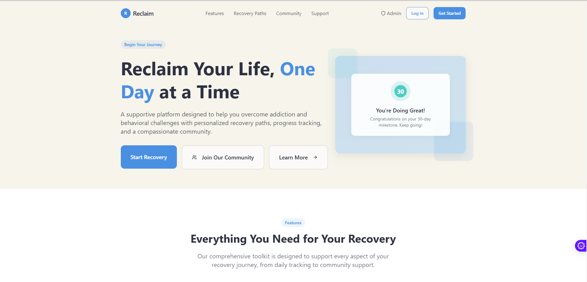
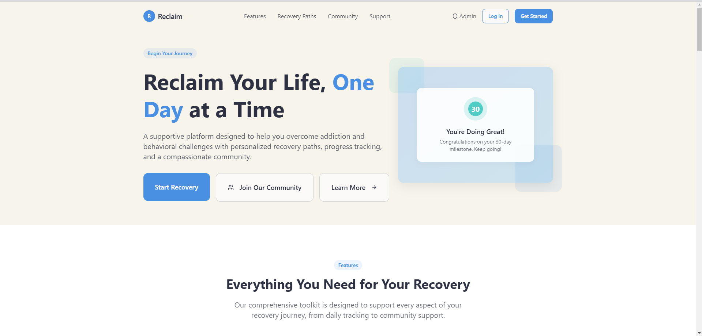
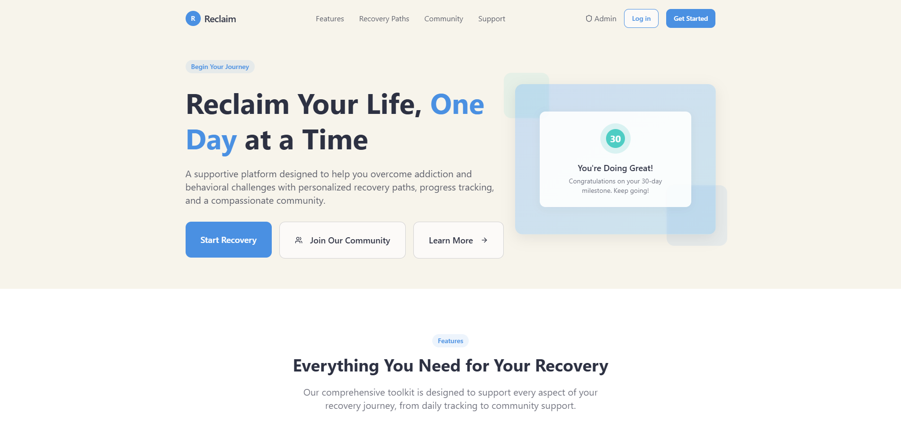

# Reclaim Recovery Platform

Reclaim is a comprehensive mental health recovery platform designed to empower individuals on their journey to wellness through community support, personalized tracking, and evidence-based resources.



## Features

### 🤝 Supportive Community
- **Community Forum**: Connect with others on similar journeys
- **Moderated Discussions**: Safe and supportive environment
- **Anonymous Posting**: Share experiences comfortably
- **Group Support**: Join topic-specific support groups



### 📊 Personal Recovery Tracking
- **Daily Check-ins**: Track your progress and mood
- **Custom Triggers**: Identify and monitor personal triggers
- **Progress Visualization**: See your journey through interactive charts
- **AI-Powered Insights**: Get personalized recommendations



### 📝 Journal & Resources
- **Private Journaling**: Document your thoughts and experiences
- **Guided Exercises**: Access therapeutic writing prompts
- **Resource Library**: Educational materials and coping strategies
- **Emergency Support**: Quick access to crisis resources


## Tech Stack

- **Frontend**: React, TypeScript, Tailwind CSS
- **Backend**: Supabase
- **Authentication**: Supabase Auth
- **Storage**: Supabase Storage
- **UI Components**: Shadcn/ui
- **Charts**: Recharts
- **Build Tool**: Vite

## Getting Started

### Prerequisites

- Node.js (v18 or higher)
- npm or yarn
- Supabase account

### Installation

1. Clone the repository
```bash
git clone https://github.com/your-username/reclaim-nurture-path.git
cd reclaim-nurture-path
```

2. Install dependencies
```bash
npm install
# or
yarn install
```

3. Set up environment variables
```bash
cp .env.example .env
```
Update the `.env` file with your Supabase credentials

4. Start the development server
```bash
npm run dev
# or
yarn dev
```

## Project Structure

```
src/
├── components/     # Reusable UI components
├── contexts/       # React contexts
├── hooks/          # Custom hooks
├── integrations/   # External service integrations
├── lib/           # Utility functions
├── pages/         # Application pages
└── styles/        # Global styles
```

## Contributing

We welcome contributions to the Reclaim Recovery Platform! Here's how you can help:

1. Fork the repository
2. Create your feature branch (`git checkout -b feature/AmazingFeature`)
3. Commit your changes (`git commit -m 'Add some AmazingFeature'`)
4. Push to the branch (`git push origin feature/AmazingFeature`)
5. Open a Pull Request

## License

This project is licensed under the MIT License - see the [LICENSE](LICENSE) file for details.

## Support

If you need help or have any questions:

- Open an issue
- Contact us at [support@reclaimrecovery.com]
- Visit our [Help Center](https://reclaimrecovery.com/help)

## Screenshots

### Dashboard
[Dashboard Screenshot - To be added]

### Profile Settings
[Profile Settings Screenshot - To be added]

### Community Forum
[Community Forum Screenshot - To be added]

## Acknowledgments

- Thanks to all contributors who have helped shape this platform
- Special thanks to our community members for their valuable feedback
- Inspired by the need for better mental health recovery tools

---

[Reclaim Recovery Platform](https://reclaimrecovery.com) | [Documentation](https://docs.reclaimrecovery.com) | [Community](https://community.reclaimrecovery.com)
